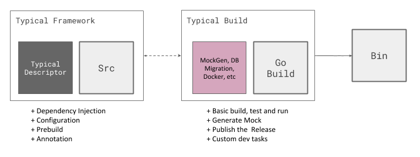

# Typical Go


A Framework + Build Tool for Productive Go Development. <https://typical-go.github.io/>

## Concept



## Install

Download the latest release from [releases page](https://github.com/typical-go/typical-go/releases)

Or 
```bash
go get -u github.com/typical-go/typical-go/cmd/typical-go
```

## Usage

### New Project

```bash
typical-go new [PACKAGE]
```

### New Module

```bash
typical-go module [MODULE_NAME]
typical-go module [MODULE_NAME] -path=[PATH]
```

### Create Wrapper

```bash
typical-go wrapper
typical-go wrapper -path=[Path]
```


## Examples

- [RESTful Server](https://github.com/typical-go/typical-rest-server)


## License

This project is licensed under the MIT License - see the [LICENSE.md](LICENSE.md) file for details


